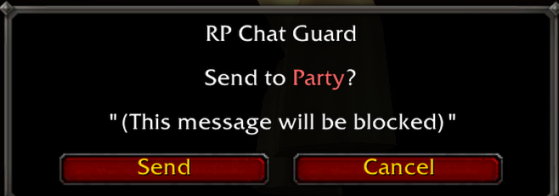

# RP Chat Guard

A World of Warcraft addon that stops you from accidentally sending in-character messages to the wrong chat channel.

## The problem

You're deep in a roleplay scene, typing in `/say` - then you hit Enter and realise you just sent it to `/guild` instead. RP Chat Guard intercepts messages to any channel you haven't marked as safe and shows a confirmation popup before anything goes out.

## Features

- Confirmation popup before sending to any guarded channel
- Configurable safe channel list - mark any channel as safe or guarded
- Persisted settings across sessions and reloads
- Slash command interface for quick adjustments

## Installation

1. Download the latest `RPChatGuard-vX.X.X.zip` from the [Releases](../../releases) page
2. Extract it so the folder sits at `World of Warcraft/_retail_/Interface/AddOns/RPChatGuard/`
3. Log in or `/reload` - the addon loads automatically

## Usage

The guard is **on by default**. Just install it and go. If a message is headed somewhere unexpected, you'll see a popup with the target channel and a preview of what you typed. Hit **Send** to confirm or **Cancel** to drop it.

Type `/rpg help` in-game for a full command list.

## Slash commands

| Command | Effect |
|---|---|
| `/rpg` | Toggle guard on/off |
| `/rpg on` / `/rpg off` | Set explicitly |
| `/rpg status` | Show current state and channel lists |
| `/rpg allow <channel>` | Add a channel to the safe list |
| `/rpg block <channel>` | Remove a channel from the safe list |
| `/rpg reset` | Restore default safe channels |
| `/rpg debug` | Toggle verbose hook logging |
| `/rpg help` | Print command reference |

Channel name shortcuts: `say`, `s`, `emote`, `em`, `e`, `me`, `whisper`, `w`, `tell`, `yell`, `y`, `guild`, `g`, `officer`, `o`, `party`, `p`, `raid`, `ra`, `rw` (raid warning), `instance`, `i`, `channel`, `bnet`

## Default safe channels

Out of the box, these channels pass through without a popup:

- Say
- Emote
- Whisper
- Yell
- BNet Whisper

Everything else (Guild, Party, Raid, Officer, Instance, numbered channels, etc.) requires confirmation.

## Development

### Linting

The project uses [luacheck](https://github.com/mpeterv/luacheck) for linting.

**Option 1: Install via luarocks (recommended if you have it):**
```bash
luarocks install luacheck
```

**Option 2: Download pre-built binary:**
Download the latest binary for your platform from the [releases page](https://github.com/mpeterv/luacheck/releases) and place it in your PATH.

Then run:
```bash
luacheck --config .luacheckrc *.lua
```

Linting is automatically run in CI on pushes and pull requests.

### Formatting

Use [stylua](https://github.com/JohnnyMorganz/StyLua) for formatting.

**Option 1: Install via Cargo (recommended if you have Rust):**
```bash
cargo install stylua
```

**Option 2: Download pre-built binary:**
Download the latest binary for your platform from the [releases page](https://github.com/JohnnyMorganz/StyLua/releases) and place it in your PATH.

Then run the format script:
```bash
./format.sh
```

This will format all `.lua` files in place.

## Screenshots



## License

MIT - see [LICENSE](LICENSE).

## Contributing

Issues and pull requests are welcome. Please test changes in-game with `/reload` before submitting.
